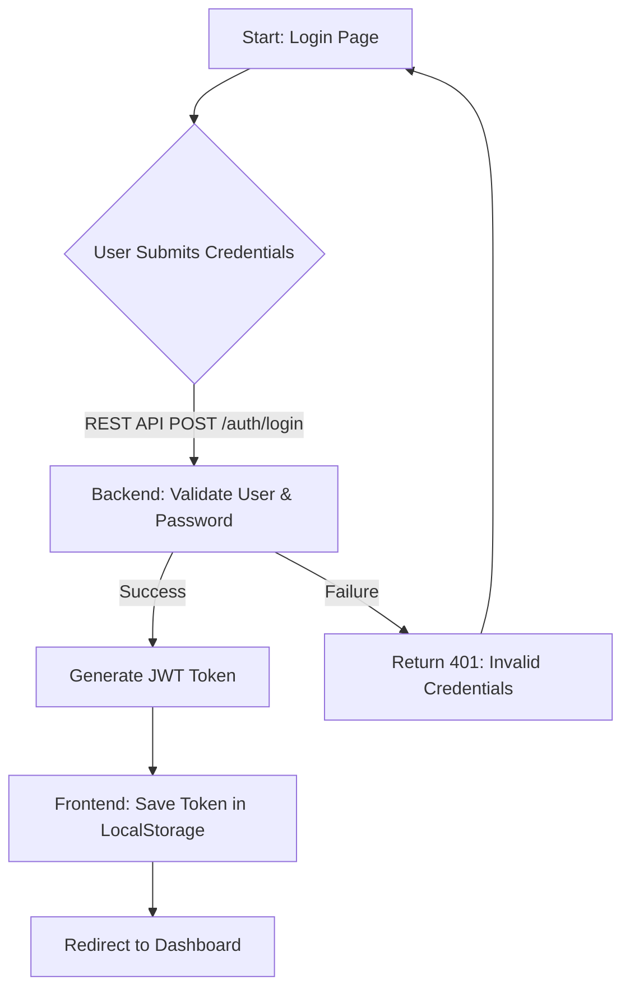
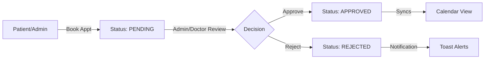
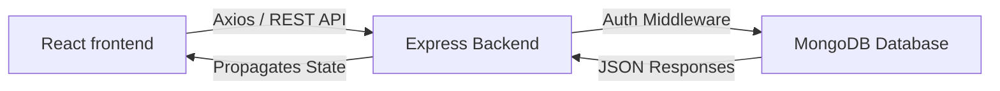

# Technical Architecture Overview

This document details the technology stack and system logic of the Doctor Appointment System.

## 🛠️ Technology Stack

| Layer | Technology | Purpose |
| :--- | :--- | :--- |
| **Frontend** | **React.js (Vite)** | Responsive single-page application |
| **UI Library** | **Material UI (MUI)** | Professional component design and layout |
| **Styling** | **Vanilla CSS + MUI SX** | Custom premium visual aesthetics |
| **State Management**| **React Context API** | User authentication and global state |
| **Backend** | **Node.js + Express** | High-performance RESTful API |
| **Database** | **MongoDB (Mongoose)**| Schema-based data persistence |
| **Security** | **JWT & BcryptJS** | Secure token-based auth and password hashing |

---

## 📊 System Flowcharts

### 1. User Authentication Flow
This diagram illustrates how users log into the system and access the protected dashboard.

### 2. Appointment Booking Lifecycle
This flow describes how a patient's booking request moves through the system.

### 3. High-Level System Architecture
The data flow between the user interface and the database.

---

## ⚙️ Key Modules
1. **Auth Service**: Manages registration, logins, and automated account recovery using **Nodemailer (Ethereal)** for mock email delivery.
2. **Management Registry**: CRUD operations for Doctors, Patients, and Timeslots.
3. **Smart Dashboard**: Context-aware widgets with deep-linking to filtered reports.
4. **Visual Architecture**:
   - **Modern Layout**: Flexbox-based centered alignment for all authentication and core views.
   - **Glassmorphism**: Translucent navigation and container styles using `backdrop-filter: blur()`.
   - **Dynamic Wallpapers**: Local state management (via `react-router-dom`) for switching page-specific background assets.
5. **Undo System**: Optimistic updates with a "Recall" window for critical deletions and status changes.
